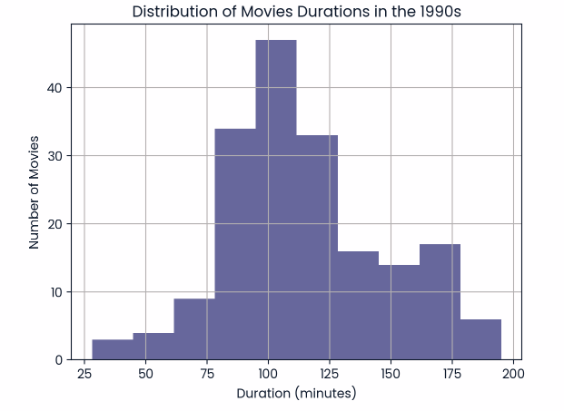

# Netflix Movies Analysis

## Project Overview
This project explores Netflix movies released in the 1990s using Python. The analysis focuses on identifying the most common movie duration and counting short action movies released during the decade.

## Objectives
- Explore the Netflix dataset.
- Filter movies released between 1990 and 1999.
- Find the most common movie duration.
- Count action movies with a duration of less than 90 minutes.
- Visualize movie durations using a histogram.

## Tools Used
- Python
- Pandas
- Matplotlib

## Project Files
- `netflix_movies_analysis.ipynb` – Jupyter Notebook containing the analysis.
- `netflix_data.csv` – Dataset used for the analysis.
- `movie_duration_distribution.png` – Histogram of movie durations.

## Dataset
The dataset includes information about Netflix titles such as:
- Title
- Type
- Release Year
- Duration
- Genre
- Country
- Director

## How to Run
1. Download the repository.
2. Install the required libraries:
   ```
   pip install pandas matplotlib
   ```
3. Open the notebook in Jupyter Notebook, VS Code, or Google Colab.
4. Run all cells.

## Visualization



## Author
Layan Alazwari
